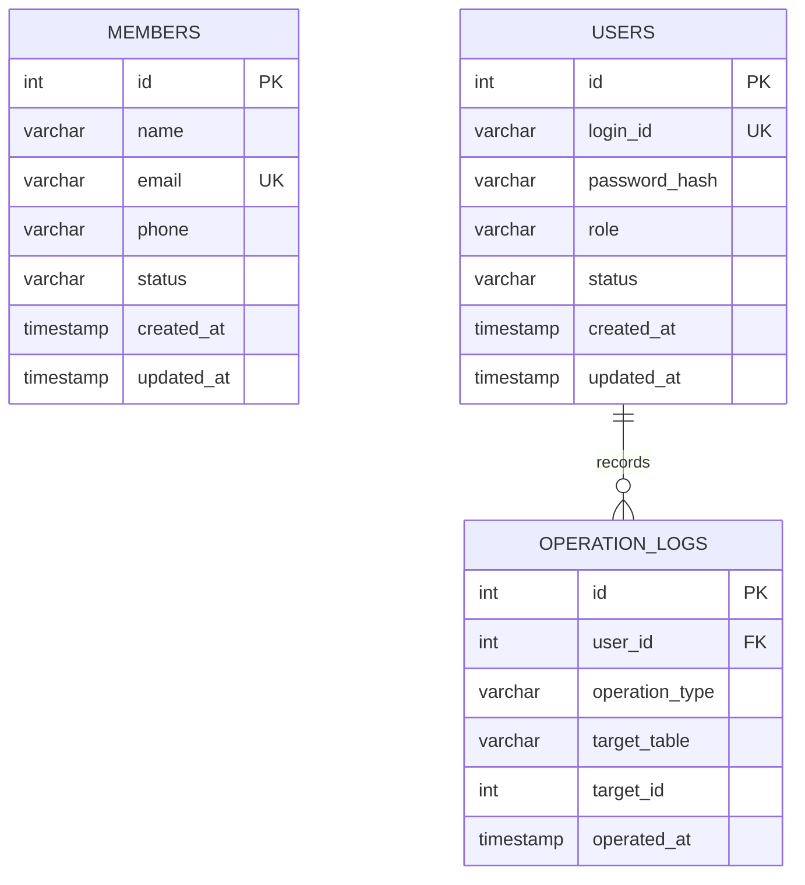
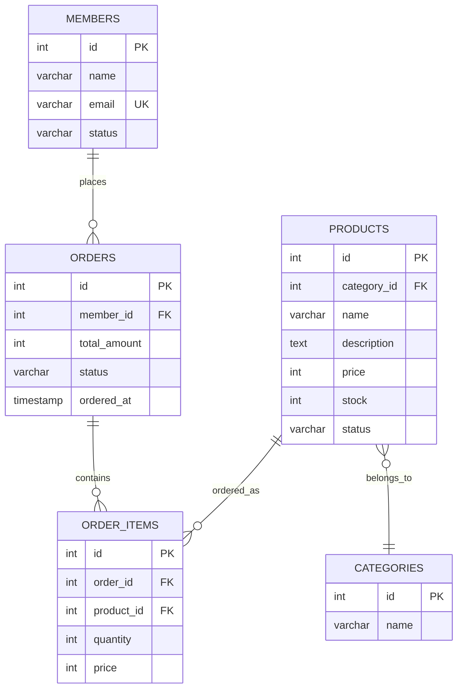
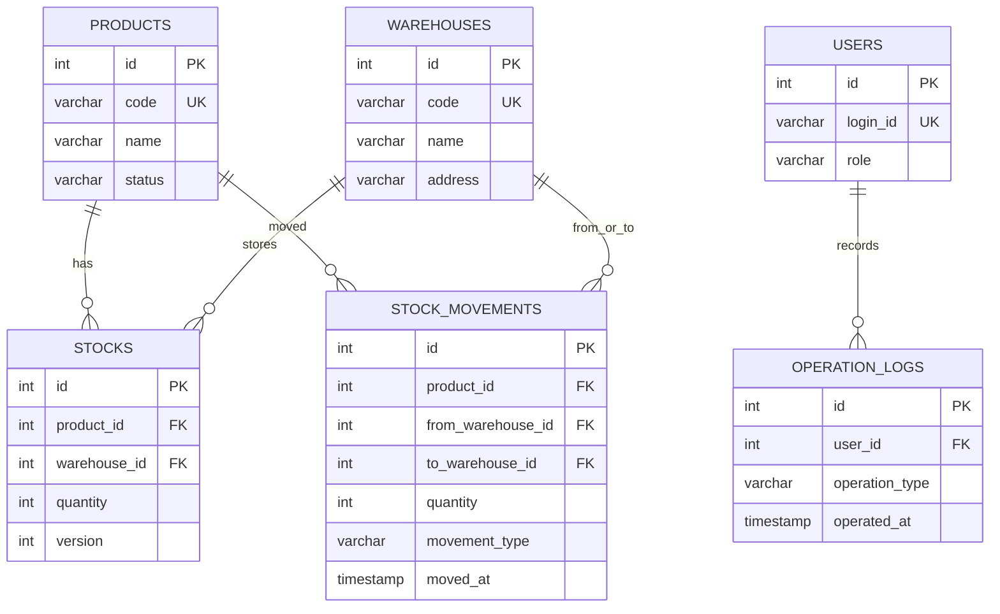

# ER図

この資料では、総合演習で扱う3つの業務システムのER設計を整理します。

## 1. 会員管理システム

## 2. ECサイト

## 3. 在庫管理システム

## 設計上の注意

- 業務データは物理削除ではなく論理削除を検討する
- 更新履歴が必要な業務では履歴テーブルを持つ
- 在庫や注文など整合性が重要な処理はトランザクション境界を明確にする
- 外部キー、ユニーク制約、インデックスを設計段階で決める
- 個人情報を含むテーブルはアクセス権限とログを設計する
