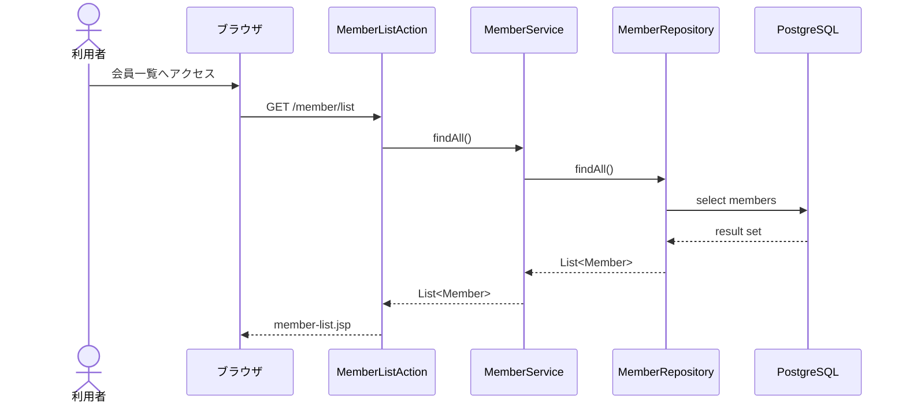
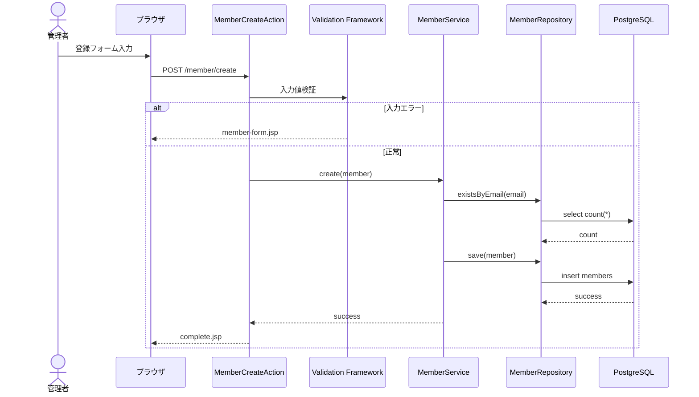
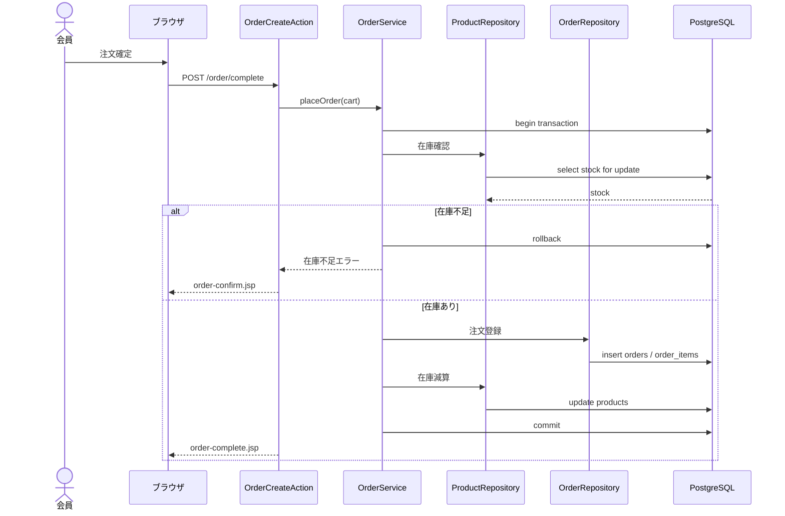
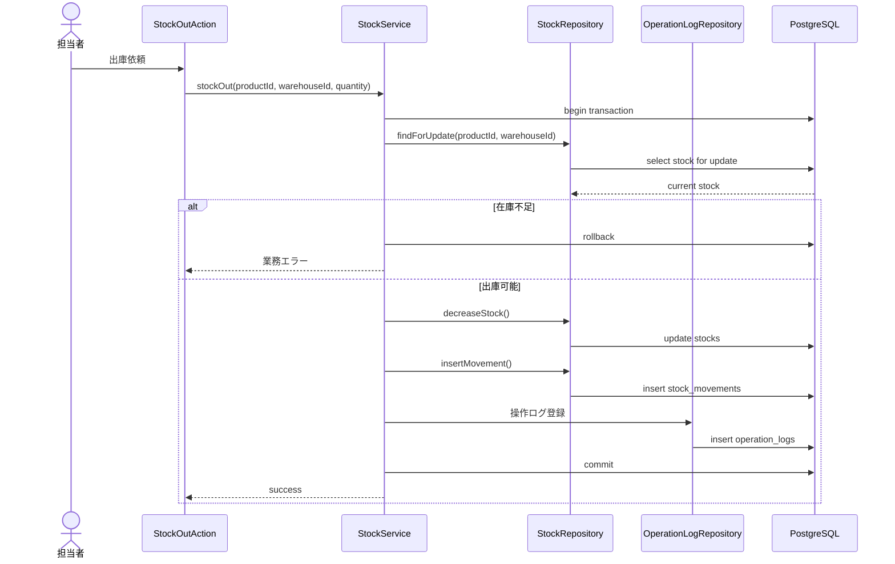

# シーケンス図

この資料では、総合演習で扱う代表的な処理の流れを示します。

## 1. 会員一覧表示

```mermaid
sequenceDiagram
    actor User as 利用者
    participant Browser as ブラウザ
    participant Action as MemberListAction
    participant Service as MemberService
    participant Repository as MemberRepository
    participant DB as PostgreSQL

    User->>Browser: 会員一覧へアクセス
    Browser->>Action: GET /member/list
    Action->>Service: findAll()
    Service->>Repository: findAll()
    Repository->>DB: select members
    DB-->>Repository: result set
    Repository-->>Service: List<Member>
    Service-->>Action: List<Member>
    Action-->>Browser: member-list.jsp
```

## 2. 会員登録

```mermaid
sequenceDiagram
    actor Admin as 管理者
    participant Browser as ブラウザ
    participant Action as MemberCreateAction
    participant Validation as Validation Framework
    participant Service as MemberService
    participant Repository as MemberRepository
    participant DB as PostgreSQL

    Admin->>Browser: 登録フォーム入力
    Browser->>Action: POST /member/create
    Action->>Validation: 入力値検証
    alt 入力エラー
        Validation-->>Browser: member-form.jsp
    else 正常
        Action->>Service: create(member)
        Service->>Repository: existsByEmail(email)
        Repository->>DB: select count(*)
        DB-->>Repository: count
        Service->>Repository: save(member)
        Repository->>DB: insert members
        DB-->>Repository: success
        Service-->>Action: success
        Action-->>Browser: complete.jsp
    end
```

## 3. ECサイト注文確定

```mermaid
sequenceDiagram
    actor Member as 会員
    participant Browser as ブラウザ
    participant Action as OrderCreateAction
    participant Service as OrderService
    participant ProductRepo as ProductRepository
    participant OrderRepo as OrderRepository
    participant DB as PostgreSQL

    Member->>Browser: 注文確定
    Browser->>Action: POST /order/complete
    Action->>Service: placeOrder(cart)
    Service->>DB: begin transaction
    Service->>ProductRepo: 在庫確認
    ProductRepo->>DB: select stock for update
    DB-->>ProductRepo: stock
    alt 在庫不足
        Service->>DB: rollback
        Service-->>Action: 在庫不足エラー
        Action-->>Browser: order-confirm.jsp
    else 在庫あり
        Service->>OrderRepo: 注文登録
        OrderRepo->>DB: insert orders / order_items
        Service->>ProductRepo: 在庫減算
        ProductRepo->>DB: update products
        Service->>DB: commit
        Action-->>Browser: order-complete.jsp
    end
```

## 4. 在庫出庫

```mermaid
sequenceDiagram
    actor Staff as 担当者
    participant Action as StockOutAction
    participant Service as StockService
    participant StockRepo as StockRepository
    participant LogRepo as OperationLogRepository
    participant DB as PostgreSQL

    Staff->>Action: 出庫依頼
    Action->>Service: stockOut(productId, warehouseId, quantity)
    Service->>DB: begin transaction
    Service->>StockRepo: findForUpdate(productId, warehouseId)
    StockRepo->>DB: select stock for update
    DB-->>StockRepo: current stock
    alt 在庫不足
        Service->>DB: rollback
        Service-->>Action: 業務エラー
    else 出庫可能
        Service->>StockRepo: decreaseStock()
        StockRepo->>DB: update stocks
        Service->>StockRepo: insertMovement()
        StockRepo->>DB: insert stock_movements
        Service->>LogRepo: 操作ログ登録
        LogRepo->>DB: insert operation_logs
        Service->>DB: commit
        Service-->>Action: success
    end
```
